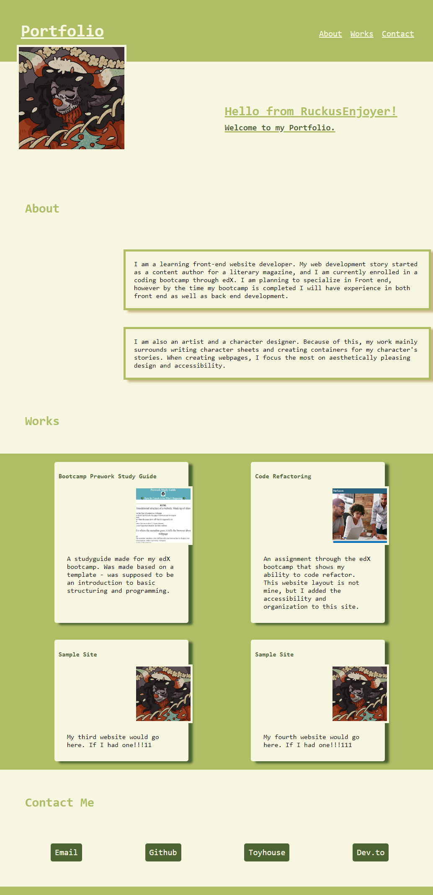

# RuckusEnjoyer's Portfolio

## Description
I created this webpage in order to store my portfolio and show off my most successful webpages. When making this webpage, I learned how to use flexbox and media queries to make a website more flexible based on screens. 

I faced a few challenges when making this piece. My Devtools' device toolbar kept breaking, and each time I would fix the problem, the next time I unloaded and reloaded the page the issue would arise again for seemingly no reason. It should, however, be fixed.

In the future, I plan to implement each website I create, both in my freetime as well as other projects I am working on through the bootcamp. I will also update my contact information once this bootcamp is complete.

In my newest update, I have made a minor update so that the images on my cards are offset the same way on all screen sizes. 

## Usage/Screenshot
To visit a website, click on the corresponding image. To navigate to various parts of this site, click on the corresponding navbar indicators.

## Credits
All artwork in this site was created by me.

## Link
https://ruckusenjoyer.github.io/portfolio/
